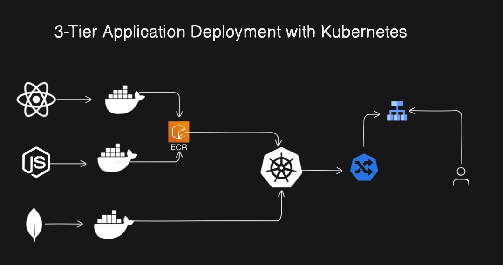

# 3-Tier-Application-Deployment-with-Kubernetes
## Architecture Diagram


## Overview

This repository contains a full-stack **MERN (MongoDB, Express.js, React, Node.js)** application deployed using modern DevOps tools and practices. The application is containerized using **Docker**, hosted on **Amazon Elastic Container Registry (ECR)**, and orchestrated with **Kubernetes**. For traffic routing and scalability, we use **Ingress Controller** and a **Load Balancer**.

This project is designed to be a **3-Tier Application Architecture** and follows best practices for containerized application development and deployment.

---

## Features

- **React Frontend**: A responsive, single-page application built with React.
- **Node.js Backend**: A robust backend API using Express.js.
- **MongoDB**: NoSQL database for storing application data.
- **Kubernetes Orchestration**: Managing application containers efficiently using Kubernetes.
- **Dockerized Services**: Each layer of the application is containerized with Docker.
- **Ingress Controller**: For routing external traffic to the Kubernetes services.
- **Load Balancer**: Ensures high availability and fault tolerance.
- **Amazon Elastic Container Registry (ECR)**: Securely stores Docker images.

---


### Flow Explanation
1. **Frontend (React)** → Containerized React app deployed on Kubernetes.
2. **Backend (Node.js)** → Express.js API containerized and managed as a Kubernetes service.
3. **Database (MongoDB)** → MongoDB instance containerized and orchestrated with Kubernetes.
4. **ECR** → Docker images are pushed to Amazon ECR for secure storage.
5. **Ingress Controller & Load Balancer** → Handle routing and distribute traffic efficiently.

---

## Getting Started

### Prerequisites
To get started with this project, ensure you have the following tools installed:
- **Node.js** (v14+)
- **Docker** (v20+)
- **Kubernetes CLI (kubectl)** (v1.20+)
- **AWS CLI** (v2+)
- **Git**
- **Ingress Controller** (e.g., NGINX)
- **Helm** (for Kubernetes configurations)

---

## How to Clone the Repository

```bash
git clone https://github.com/sjibran/mern-kubernetes-deployment.git
cd mern-kubernetes-deployment
```


This `README.md` is structured professionally, includes SEO keywords, and provides clear instructions for cloning, deploying, and contributing to your project. Let me know if you need further tweaks!
